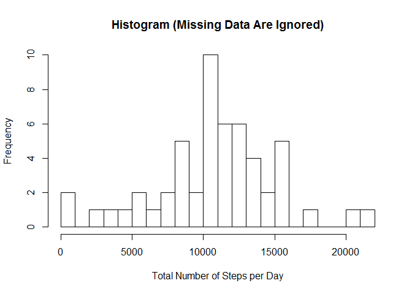
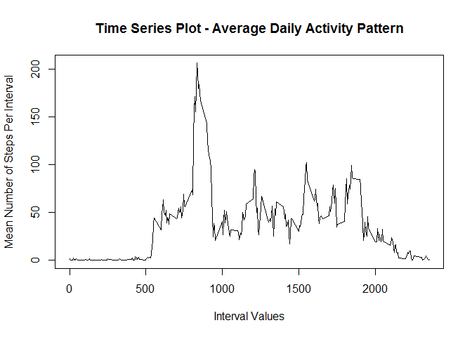
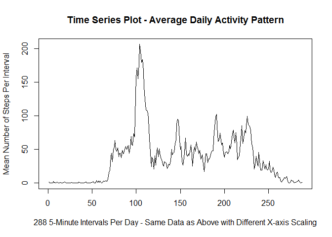
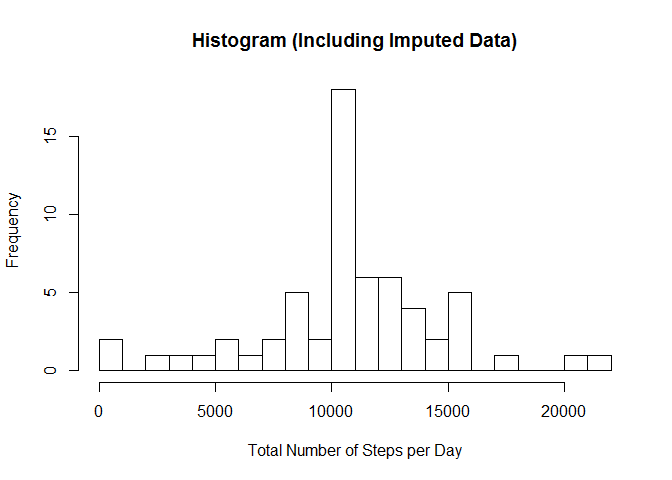
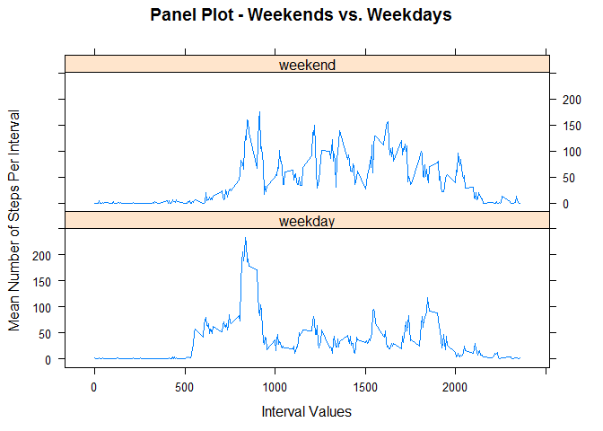

# Reproducible Research Project 1

```r
## Script:  project1.R
## Project: Reproducible Research Project 1
## Date:    07-18-2016

## Housekeeping
#  Clean up RStudio
rm(list=ls())
library(knitr)
```

```
## Warning: package 'knitr' was built under R version 3.2.5
```

```r
opts_chunk$set(echo = TRUE)
library(dplyr)
```

```
## Warning: package 'dplyr' was built under R version 3.2.5
```

```
## 
## Attaching package: 'dplyr'
```

```
## The following objects are masked from 'package:stats':
## 
##     filter, lag
```

```
## The following objects are masked from 'package:base':
## 
##     intersect, setdiff, setequal, union
```

```r
library(lattice)

## Loading and preprocessing the data
#  Import data into R using the read.csv() function
#  The input file is in the working directory
#  Transform the Date value
activity_data <- read.csv('Activity.csv', header=TRUE, sep=',', na.strings='NA', colClasses = c(date = "Date"))

## What is the mean total number of steps taken per day (ignoring missing values)? 
#  Aggregate the data to calculate total number of steps taken per day
TotalSteps <- with(activity_data, aggregate(steps, by=list(date), sum))
#  Create a histogram of the total number of steps taken per day
hist(TotalSteps$x, 
     main = "Histogram (Missing Data Are Ignored)", 
     xlab = "Total Number of Steps per Day", 
     ylab = "Frequency", 
     breaks = 20)
```

<!-- -->

```r
#  Calculate the mean and median of the total number of steps taken each day
mean_steps <- mean(TotalSteps$x,   na.rm = TRUE)
mean_steps
```

```
## [1] 10766.19
```

```r
median_steps <- median(TotalSteps$x, na.rm = TRUE)
median_steps
```

```
## [1] 10765
```

```r
#  What is the average daily activity pattern?
#  Aggregate the data to calculate the mean number of steps taken per interval
IntervalSteps <- with(activity_data, aggregate(steps, by=list(interval), na.rm=TRUE, mean))                                  

#  Create a time series plot of the 5-minute interval (x-axis) and the overall average number of steps taken per interval
plot(IntervalSteps$Group.1,
     IntervalSteps$x,
     type="l",
     main = "Time Series Plot - Average Daily Activity Pattern", 
     xlab = "Interval Values", 
     ylab = "Mean Number of Steps Per Interval") 
```

<!-- -->

```r
plot(IntervalSteps$x,
     type="l",
     main = "Time Series Plot - Average Daily Activity Pattern", 
     xlab = "288 5-Minute Intervals Per Day - Same Data as Above with Different X-axis Scaling", 
     ylab = "Mean Number of Steps Per Interval") 
```

<!-- -->

```r
#  Identify the 5-minute interval that contains the maximum number of steps
IntervalSteps[which.max(IntervalSteps$x), ]
```

```
##     Group.1        x
## 104     835 206.1698
```

```r
## Imputing missing values
#  Calculate the total number of missing values in the data set
sum(is.na(activity_data$steps))
```

```
## [1] 2304
```

```r
#  The strategy for filling in all missing values is to use the mean number of steps taken per interval, 
#  which is recalculated here using the tapply function
IntervalSteps2 <- tapply(activity_data$steps, activity_data$interval, mean, na.rm=TRUE, simplify=TRUE)
activity_impute <- activity_data
nas <- is.na(activity_impute$steps)
activity_impute$steps[nas] <- IntervalSteps2[as.character(activity_impute$interval[nas])]
# Confirm that all missing values have been filled with an imputed value
sum(is.na(activity_impute$steps))
```

```
## [1] 0
```

```r
#  Aggregate the data to calculate total number of steps taken per day
TotalSteps2 <- with(activity_impute, aggregate(steps, by=list(date), sum))
#  Create a histogram of the total number of steps taken per day
hist(TotalSteps2$x, 
     main = "Histogram (Including Imputed Data)", 
     xlab = "Total Number of Steps per Day", 
     ylab = "Frequency", 
     breaks = 20)
```

<!-- -->

```r
#  Calculate the mean and median of the total number of steps taken each day
mean_steps2 <- mean(TotalSteps2$x,   na.rm = TRUE)
mean_steps2
```

```
## [1] 10766.19
```

```r
median_steps2 <- median(TotalSteps2$x, na.rm = TRUE)
median_steps2
```

```
## [1] 10766.19
```

```r
## Are there differences in activity patterns between weekdays and weekends?
#  Create a factor variable with two levels:  "weekday" and "weekend"

activity_data <- mutate(activity_data, daytype = ifelse(weekdays(activity_data$date) == "Saturday" | weekdays(activity_data$date) == "Sunday", "weekend", "weekday"))
activity_data$daytype <- as.factor(activity_data$daytype)
#  Aggregate the data to calculate the mean number of steps taken per interval
IntervalSteps3 <- with(activity_data, aggregate(steps, by=list(daytype,interval), na.rm=TRUE, mean))
#  Create a panel plot of the time series plot

xyplot(x ~ Group.2 | factor(Group.1),
      layout = c(1, 2),
      main = "Panel Plot - Weekends vs. Weekdays", 
      xlab = "Interval Values",
      ylab = "Mean Number of Steps Per Interval",
      type = "l",
      data = IntervalSteps3)
```

<!-- -->
---
End of Document
